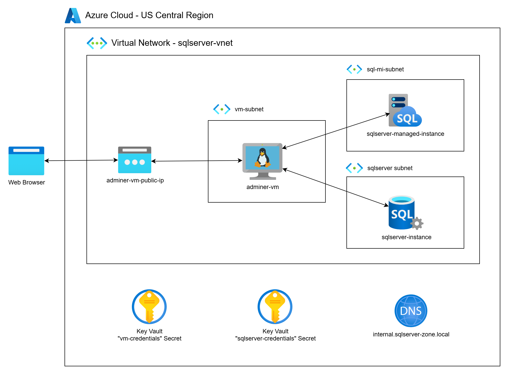
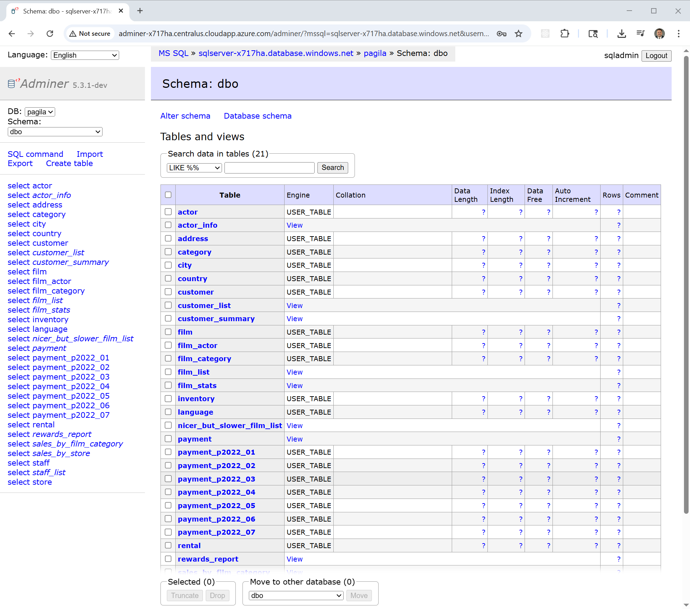

# Deploying Azure SQL Server with Managed Instance, Private Networking, and Adminer

This project demonstrates how to deploy a secure, private Microsoft Azure SQL Server environment using Terraform. The deployment provisions both a **standard Azure SQL Server instance** and a **SQL Managed Instance (MI)**, integrated into a custom virtual network with private endpoints, secured by a Private DNS Zone, and leveraging Azure Key Vault for credential storage. A lightweight Ubuntu virtual machine running [Adminer](https://www.adminer.org/) is also deployed to provide private, browser-based access to the databases.

As part of the configuration, the [Pagila-SQLServer](https://github.com/mamonaco1973/pagila-sqlserver) sample dataset—a fictional DVD rental database—is deployed to demonstrate real-world querying and database administration in a private cloud context. This solution is ideal for developers and teams building internal-facing applications requiring secure, private access to SQL Server resources.



## What You'll Learn

- How to deploy **both Azure SQL Server and SQL Managed Instance** using Terraform
- How to configure a **custom virtual network, subnets, route tables, and Private DNS Zones** for secure, internal-only connectivity
- How to use **Azure Key Vault** to securely store and retrieve database credentials
- How to provision an **Adminer VM** for browser-based database administration
- Best practices for **private endpoints, secure connectivity, and TLS enforcement** in Azure SQL deployments

## Comparing Azure SQL Server and Azure SQL Managed Instance

Azure offers two main PaaS deployment options for SQL Server workloads. This project deploys both for demonstration purposes:

| Feature                        | Azure SQL Server (Single Server)                                | Azure SQL Managed Instance (MI)                               |
|--------------------------------|-----------------------------------------------------------------|---------------------------------------------------------------|
| **Purpose**                    | Lightweight, cost-effective managed SQL database               | Full SQL Server engine compatibility in a managed service    |
| **SQL Server Feature Support** | Limited compared to on-prem SQL Server                         | Nearly 100% compatibility with on-prem SQL Server            |
| **Networking**                 | Private endpoint or public endpoint options                    | Deployed into private VNet, fully isolated                   |
| **Instance-level features**    | No SQL Agent, limited cross-database queries                   | Supports SQL Agent, cross-database transactions, CLR, etc.   |
| **Managed Maintenance**        | Fully managed patches, backups, HA                            | Fully managed, with more control over maintenance windows    |
| **Best Use Case**              | Simple applications, microservices backends                   | Enterprise workloads requiring full SQL Server capabilities  |

This project provisions both resources, allowing you to test connectivity, compare features, and choose the right fit for your use case.

## Prerequisites

* [An Azure Account](https://portal.azure.com/)
* [Install AZ CLI](https://learn.microsoft.com/en-us/cli/azure/install-azure-cli) 
* [Install Latest Terraform](https://developer.hashicorp.com/terraform/install)

If this is your first time watching our content, we recommend starting with this video: [Azure + Terraform: Easy Setup](https://youtu.be/j4aRjgH5H8Q). It provides a step-by-step guide to properly configure Terraform, and the AZ CLI.

## Download this Repository

```bash
git clone https://github.com/mamonaco1973/azure-sqlserver.git
cd azure-sqlserver
```

## Build the Code

Run [check_env](check_env.sh) then run [apply](apply.sh).

```bash
~/azure-sqlserver$ ./apply.sh
NOTE: Validating that required commands are found in your PATH.
NOTE: az is found in the current PATH.
NOTE: terraform is found in the current PATH.
NOTE: jq is found in the current PATH.
NOTE: All required commands are available.
NOTE: Validating that required environment variables are set.
NOTE: ARM_CLIENT_ID is set.
NOTE: ARM_CLIENT_SECRET is set.
NOTE: ARM_SUBSCRIPTION_ID is set.
NOTE: ARM_TENANT_ID is set.
NOTE: All required environment variables are set.
NOTE: Logging in to Azure using Service Principal...
NOTE: Successfully logged into Azure.
Initializing the backend...
Initializing provider plugins...
Terraform has been successfully initialized!
```

## Build Results

After applying the Terraform scripts, the following Azure resources will be created:

### Networking (networking.tf)
- Virtual Network: `project-vnet`  
  - Address space: `10.0.0.0/23`
- Subnet for SQL Server: `sqlserver-subnet` (`10.0.0.0/25`)
- Subnet for SQL Managed Instance: `sql-mi-subnet` with required route table
- Private DNS Zone for private link resolution
- NSG rules allowing SQL traffic from Adminer VM

### Azure Key Vault (vault.tf)
- Key Vault: `creds-kv-suffix`
  - Stores SQL admin credentials
  - Access policies grant Adminer VM read permissions

### Azure SQL Server (sqlserver.tf)
- Deployed with:
  - Private network access only
  - TLS 1.2 enforced
  - Admin credentials stored in Key Vault
  - Preloaded with [Pagila-SQLServer sample database](https://github.com/mamonaco1973/pagila-sqlserver)

### Azure SQL Managed Instance (sqlserver-mi.tf)
- Fully managed Azure SQL MI
- Private endpoint and DNS integration
- Configured vCores, storage, collation, and TLS

### Adminer VM (adminer.tf)
- Ubuntu-based virtual machine
- Hosts Adminer for browser-based SQL administration
- Connected privately to both SQL Server and MI

## Adminer Demo

[Adminer](https://www.adminer.org/) is a lightweight web-based SQL database management tool.



Example queries against the Pagila sample database:

Query 1:
```sql
SELECT TOP 100                       -- Limit the number of rows returned to 100
    f.title AS film_title,           -- Select the 'title' column from the 'film' table and rename it to 'film_title'
    a.first_name + ' ' + a.last_name AS actor_name 
                                     -- Concatenate 'first_name' and 'last_name' from the 'actor' table with a space
                                     -- Alias the concatenated result as 'actor_name' for readability
FROM
    film f                           -- Use the 'film' table as the primary dataset and alias it as 'f'
JOIN
    film_actor fa                    -- Join the linking table 'film_actor' that associates films with actors
    ON f.film_id = fa.film_id        -- Match rows where the film's unique ID equals the film_actor's film ID
JOIN
    actor a                          -- Join the 'actor' table to retrieve actor details
    ON fa.actor_id = a.actor_id      -- Match rows where the actor's unique ID equals the film_actor's actor ID
ORDER BY 
    f.title,                         -- Sort results by the film title in ascending alphabetical order
    actor_name;                      -- Within each film, sort the actor names alphabetically
```

Query 2:

```sql
SELECT TOP 100                               -- Limit the output to the first 100 rows returned
    f.title,                                 -- Select the 'title' column from the 'film' table
    STRING_AGG(a.first_name + ' ' + a.last_name, ', ') AS actor_names
                                             -- Use STRING_AGG to concatenate all actor names for each film
                                             -- Combine 'first_name' and 'last_name' separated by a space
                                             -- Separate multiple actor names in the aggregated string with a comma and a space
                                             -- Alias the resulting concatenated list as 'actor_names'
FROM
    film f                                   -- Use the 'film' table as the main dataset and alias it as 'f'
JOIN
    film_actor fa                            -- Join the linking table 'film_actor' to connect films and actors
    ON f.film_id = fa.film_id                -- Match rows where film IDs from both tables are equal
JOIN
    actor a                                  -- Join the 'actor' table to get actor details
    ON fa.actor_id = a.actor_id              -- Match rows where actor IDs from both tables are equal
GROUP BY
    f.title                                  -- Group the results by each film title so all associated actors are aggregated together
ORDER BY
    f.title;                                 -- Sort the output alphabetically by film title
```

